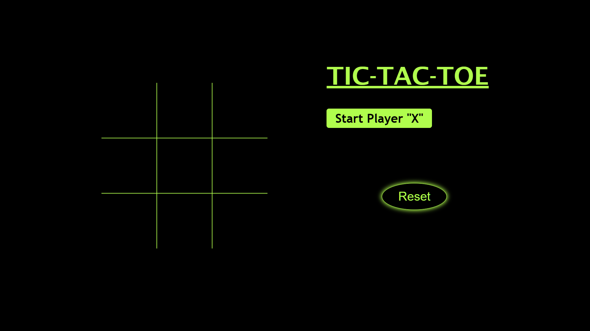

# Tic-Tac-Toe Game

A simple **Tic-Tac-Toe** game built using HTML, CSS, and JavaScript. It includes player turns, winner detection, and a reset functionality.

---

## **Features**
- **Player Turns:** Alternates between `X` and `O`.
- **Winner Detection:** Highlights the winning combination with a red line.
- **Reset Button:** Resets the game board for a new round.

---

## **How to Play**
1. Click on the empty boxes to make your move.
2. The game detects the winner and displays the winning line.
3. Press the **Reset** button to start a new game.

---

## **Screenshots**

---

## **Technologies Used**
- **HTML, CSS, JavaScript**

